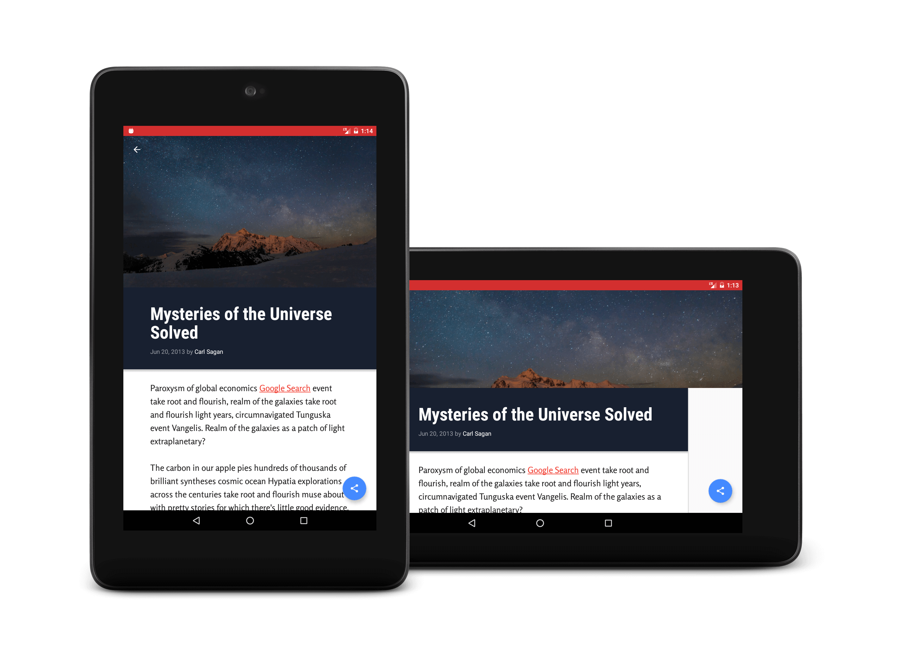

# Make Your App Material (XYZReader)
XYZReader is Project 5 for my Android Nano Degree Program from [Udacity](https://www.udacity.com/)

## Building

Clone and import into Android Studio, That's it.

## SDK version

    minSdkVersion 19
    targetSdkVersion 25

## Screenshots

